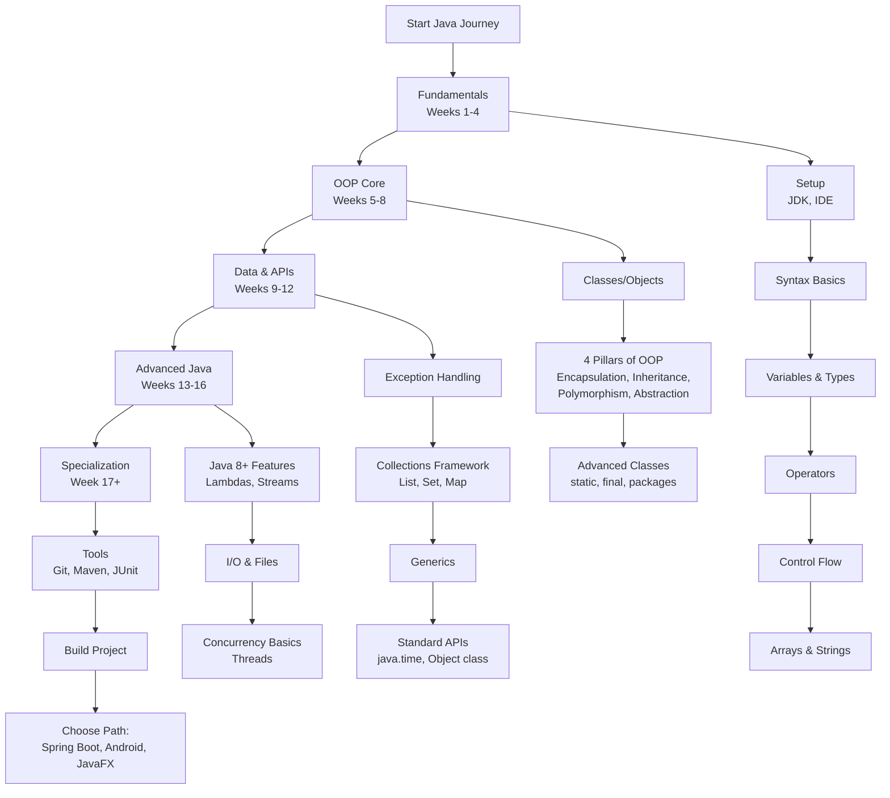

# Java Developer Learning Path: A Structured Curriculum

This comprehensive roadmap provides a structured approach to mastering Java development. The curriculum is designed sequentially, with each module building upon previous knowledge to ensure a solid foundation and progressive skill development.

---

## Phase 1: Core Fundamentals & Syntax (Weeks 1-4)

*   [**Module 1: Introduction & Development Environment**](https://github.com/ahmadrizal1st/java-intro/#readme)
    *   Java Overview: History, Philosophy, and Key Characteristics (WORA, OOP, Robustness)
    *   Understanding the Java Ecosystem: JVM, JRE, and JDK
    *   Installing the JDK and Configuring Environment Variables (`JAVA_HOME`, `PATH`)
    *   Setting Up an Integrated Development Environment (IntelliJ IDEA Recommended)
    *   Creating, Compiling, and Executing a "Hello World" Application

*   **Module 2: Basic Syntax & Program Structure**
    *   Anatomy of a Java Program: `class` Declaration and the `main` Method
    *   Code Documentation: Comments (`//`, `/* */`) and Javadoc (`/** */`)
    *   Language Syntax: Keywords and Identifiers (Naming Conventions)
    *   Utilizing Command Line Arguments

*   **Module 3: Variables and Data Types**
    *   Primitive Data Types: `byte`, `short`, `int`, `long`, `float`, `double`, `char`, `boolean`
    *   Reference Data Types: Introduction to `String`, `Array`, and Custom `Objects`
    *   Variable Declaration, Initialization, and Scope
    *   Defining Constants with the `final` Keyword
    *   Type Conversion: Implicit (Widening) and Explicit (Narrowing) Casting

*   **Module 4: Operators and Expressions**
    *   Arithmetic Operators: `+`, `-`, `*`, `/`, `%`, `++`, `--`
    *   Relational/Comparison Operators: `==`, `!=`, `>`, `<`, `>=`, `<=`
    *   Logical Operators: `&&`, `||`, `!` (Including Short-Circuiting)
    *   Assignment Operators: `=`, `+=`, `-=`, `*=`, `/=`
    *   Conditional (Ternary) Operator: `? :`

*   **Module 5: Control Flow Statements**
    *   Conditional Statements: `if`, `if-else`, and `if-else-if` Ladder
    *   Multi-way Branching: The `switch` Statement (Traditional and Expression Style)
    *   Iteration Statements: `for` Loop (Standard and Enhanced for-each), `while`, `do-while`
    *   Flow Control: `break`, `continue`, and `return` Statements

*   **Module 6: Arrays and Strings**
    *   Arrays: Declaration, Instantiation, and Initialization (Single and Multi-Dimensional)
    *   Common Array Operations: Iteration, Copying, and Manipulation
    *   The `String` Class: Immutability Concept and Essential Methods
    *   Mutable String Handling: `StringBuilder` and `StringBuffer` Classes

---

## Phase 2: Object-Oriented Programming (OOP) Core (Weeks 5-8)

*   **Module 7: Introduction to Classes and Objects**
    *   Principles of Object-Oriented Programming (OOP)
    *   Classes as Blueprints and Objects as Instances
    *   Defining Class Members: Fields (Attributes) and Methods (Behaviors)
    *   Object Construction: Default and Parameterized Constructors
    *   The `this` Keyword Reference

*   **Module 8: Core OOP Principles**
    *   **Encapsulation:** Data Hiding with `private` Access and Accessor/Mutator Methods
    *   **Inheritance:** Establishing IS-A Relationships with `extends`, Using `super`
    *   **Polymorphism:** Method Overloading (Compile-Time) vs. Overriding (Runtime)
    *   **Abstraction:** Defining Contracts with Abstract Classes and Interfaces

*   **Module 9: Advanced Class Design**
    *   Class Modifiers: `static` Members and Blocks, `final` Classes and Methods
    *   Code Organization: Creating and Using `packages`
    *   Access Control: `public`, `protected`, Package-Private, and `private` Modifiers
    *   Nested Classes: Inner, Static Nested, Local, and Anonymous Classes

---

## Phase 3: Data Handling & Standard APIs (Weeks 9-12)

*   **Module 10: Exception Handling**
    *   Error Types: Distinguishing Between `Error` and `Exception`
    *   Exception Categories: Checked vs. Unchecked Exceptions
    *   Handling Exceptions: `try-catch-finally` Blocks
    *   Exception Propagation: `throw` and `throws` Keywords
    *   Resource Management: Try-with-Resources Statement

*   **Module 11: Collections Framework**
    *   Framework Architecture: `Collection` and `Map` Hierarchies
    *   **Lists:** `ArrayList` and `LinkedList` Implementations
    *   **Sets:** `HashSet`, `LinkedHashSet`, and `TreeSet` Implementations
    *   **Maps:** `HashMap`, `LinkedHashMap`, and `TreeMap` Implementations
    *   **Queues:** `PriorityQueue` and `ArrayDeque`
    *   Iteration Techniques: `Iterator` and Enhanced for-each Loop
    *   Utility Classes: `Collections` and `Arrays`

*   **Module 12: Generics**
    *   Introduction to Generics: Type Safety and Eliminating Casts
    *   Implementing Generic Classes and Methods
    *   Using Bounded Type Parameters (`<T extends Number>`)
    *   Wildcard Types: `?`, `? extends T`, `? super T`

*   **Module 13: Essential Java APIs**
    *   Root Class: `Object` Methods (`equals()`, `hashCode()`, `toString()`)
    *   Modern Date/Time API: `LocalDate`, `LocalTime`, `LocalDateTime`, `Duration`, `Period`
    *   Utility Classes: `Scanner` for Input, `Random` for Number Generation

---

## Phase 4: Advanced Topics & Modern Java Features (Weeks 13-16)

*   **Module 14: Functional Programming Features (Java 8+)**
    *   Lambda Expressions: Syntax and Target Typing
    *   Built-in Functional Interfaces: `Predicate`, `Function`, `Consumer`, `Supplier`
    *   Method and Constructor References
    *   Stream API: Intermediate Operations (`filter`, `map`, `sorted`), Terminal Operations (`collect`, `forEach`, `reduce`)

*   **Module 15: Input/Output (I/O) Operations**
    *   I/O Streams: Byte Streams (`InputStream`, `OutputStream`) and Character Streams (`Reader`, `Writer`)
    *   Buffered I/O: `BufferedReader` and `BufferedWriter`
    *   Object Serialization and Deserialization

*   **Module 16: Concurrency Fundamentals**
    *   Processes vs. Threads
    *   Thread Creation: Extending `Thread` vs. Implementing `Runnable`
    *   Thread Lifecycle and States
    *   Basic Thread Synchronization with the `synchronized` Keyword

---

## Phase 5: Professional Development & Specialization

*   **Module 17: Essential Development Tools**
    *   Build Automation: **Maven** or **Gradle** for Dependency Management and Project Building
    *   Version Control: **Git** Fundamentals (Repository Management, Basic Workflow)
    *   Testing: Writing Unit Tests with **JUnit 5**

*   **Module 18: Capstone Project & Career Specialization**
    *   **Develop a Console-Based CRUD Application** (e.g., Library Management, Inventory System)
    *   **Select a Specialization Path:**
        *   **Enterprise Backend Development:** Spring Boot Framework, Data Persistence with JPA, RESTful Web Services
        *   **Mobile Application Development:** Android Studio, Android SDK (Java/Kotlin)
        *   **Desktop GUI Applications:** JavaFX for Modern Cross-Platform Interfaces
